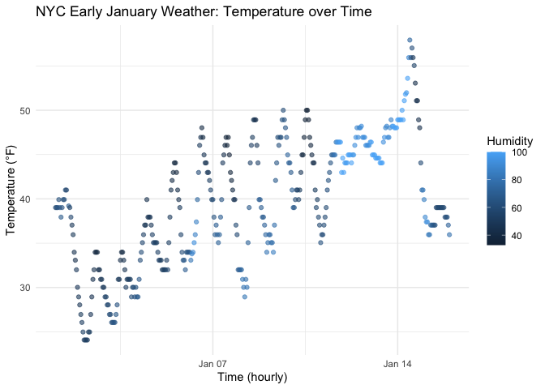

p8105_hw1_bx2232
================

``` r
library(moderndive)
library(tidyverse)
```

    ## ── Attaching core tidyverse packages ──────────────────────── tidyverse 2.0.0 ──
    ## ✔ dplyr     1.1.4     ✔ readr     2.1.5
    ## ✔ forcats   1.0.0     ✔ stringr   1.5.1
    ## ✔ ggplot2   3.5.2     ✔ tibble    3.3.0
    ## ✔ lubridate 1.9.4     ✔ tidyr     1.3.1
    ## ✔ purrr     1.1.0     
    ## ── Conflicts ────────────────────────────────────────── tidyverse_conflicts() ──
    ## ✖ dplyr::filter() masks stats::filter()
    ## ✖ dplyr::lag()    masks stats::lag()
    ## ℹ Use the conflicted package (<http://conflicted.r-lib.org/>) to force all conflicts to become errors

\#Problem 1

``` r
data("early_january_weather")
weather <- early_january_weather
```

``` r
p1 <- ggplot(weather, aes(x = time_hour, y = temp, color = humid)) +
  geom_point(alpha = 0.6) +
  labs(
    x = "Time (hourly)",
    y = "Temperature (°F)",
    color = "Humidity",
    title = "NYC Early January Weather: Temperature over Time"
  ) +
  theme_minimal()
p1
```

<!-- -->

``` r
ggsave("p1_scatter_temp_time.png", plot = p1, width = 7, height = 4)
```

Temperatures show daily cycles; humidity varies over time. Color
gradient helps spot more humid periods.

\#Problem 2

``` r
n   <- 10
num <- rnorm(n)                               
logi <- num > 0                               
char <- sample(letters, n)                   
fct  <- factor(sample(c("low","med","high"), n, TRUE),
               levels = c("low","med","high"))

df <- tibble(num, logi, char, fct)
df
```

    ## # A tibble: 10 × 4
    ##       num logi  char  fct  
    ##     <dbl> <lgl> <chr> <fct>
    ##  1 -0.204 FALSE k     med  
    ##  2 -0.164 FALSE p     low  
    ##  3  0.197 TRUE  e     low  
    ##  4 -1.82  FALSE j     med  
    ##  5  0.808 TRUE  b     high 
    ##  6  0.390 TRUE  o     high 
    ##  7 -0.667 FALSE n     high 
    ##  8  0.531 TRUE  l     high 
    ##  9  0.830 TRUE  i     low  
    ## 10 -1.88  FALSE q     high

``` r
mean_num  <- mean(df$num)    
mean_logi <- mean(df$logi)   # works; TRUE=1, FALSE=0

list(mean_numeric = mean_num,
     mean_logical = mean_logi)
```

    ## $mean_numeric
    ## [1] -0.1971779
    ## 
    ## $mean_logical
    ## [1] 0.5

``` r
as_numeric_logi <- as.numeric(df$logi)  
as_numeric_char <- suppressWarnings(as.numeric(df$char))  
as_numeric_fct  <- as.numeric(df$fct)  
```
